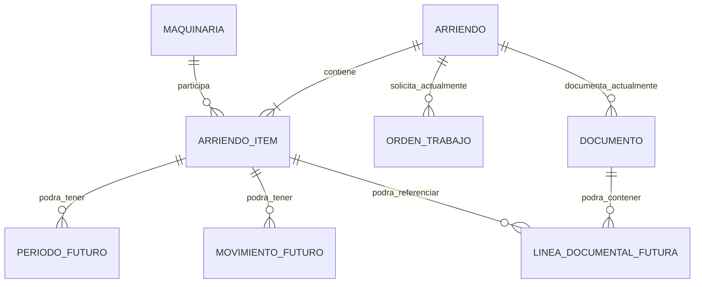

# Diseño incremental del dominio multi-máquina

## 1. Propósito y estado de la decisión

**Estado:** propuesta arquitectónica recomendada para implementación incremental; no es una implementación ni autoriza modificar datos. Este documento registra el diseño del PROMPT 014 sobre el código integrado en `work`.

El problema es que una `OrdenTrabajo` (OT) admite varias entradas en `detalle_lineas`, pero `Arriendo` y la propia OT solo pueden referenciar una `Maquinaria`. En `OrdenTrabajoViewSet.create` la primera serie resoluble se convierte en `maquinaria_principal`; las restantes permanecen solo en JSON. No existe, por tanto, un conjunto relacional completo de activos del contrato.

El alcance es definir `Arriendo` como cabecera y el futuro `ArriendoItem` como participación de cada activo, junto con una migración aditiva, verificable y reversible. Quedan pendientes las reglas comerciales sobre reingresos, estados agregados, fechas, tarifas, retiro parcial y documentos por línea. Se excluyen expresamente modelos, migraciones, backfills, API, frontend, estados y operaciones nuevas.

## 2. Modelo actual verificado

### 2.1 Modelos, relaciones y restricciones

No hay `ArriendoItem`, períodos, movimientos ni líneas documentales normalizadas implementados.

* `Maquinaria`: PK implícita; `marca` obligatoria; `modelo`, `serie`, `descripcion`, `altura`, `anio`, `tonelaje`, `carga`, `tipo_altura` y `combustible` permiten `NULL`/blanco según el campo. `serie` es `CharField(120)`, nullable, blank y `unique=True`. `categoria` usa `equipos_altura`, `camiones`, `equipos_carga`, `otro`, con `otro` por defecto. `estado` tiene por modelo solo `Disponible` y `Para venta`, con `Disponible` por defecto (aunque flujos/tests escriben también `Arrendada`, evidencia de un valor operacional no cubierto por choices). No tiene restricciones ni índices explícitos adicionales.
* `Arriendo`: PK implícita; FK opcionales `maquinaria` (`PROTECT`, `related_name="arriendos"`), `cliente` (`PROTECT`, `arriendos`) y `obra` (`PROTECT`, `arriendos`); `fecha_inicio` obligatoria; `fecha_termino` nullable/blank; `periodo` obligatorio (`Dia`, `Semana`, `Mes`); `tarifa` decimal obligatoria; `estado` texto obligatorio con `Activo` por defecto y sin choices. `db_table="Arriendo"`; no hay unicidad, constraint ni índice explícito que impida dos arriendos activos del mismo activo.
* `OrdenTrabajo`: FK opcional a `Arriendo` (`PROTECT`, `ordenes`), FK obligatoria a `Cliente` (`PROTECT`, `ordenes`) y FK opcional a `Maquinaria` (`PROTECT`, `ordenes`). `tipo`: `ALTA`, `PROL`, `TRAS`, `RETI`, `SERV`; `estado`: `PEND`, `PROC`, `ANUL` (`PEND` por defecto); `tipo_comercial` nullable (`A`, `V`, `T`); `fecha_creacion` automática; `fecha_cierre` nullable; `es_facturable=False`; `factura` y `guia` son FK opcionales a `Documento` con `SET_NULL` y `related_name` `ot_facturadas`/`ot_guias`. Los snapshots `direccion`, `obra_nombre`, `contactos`, `orden_compra`, `vendedor`, `fecha_emision_doc`, `observaciones` son opcionales. `detalle_lineas` es `JSONField(default=list, blank=True)`. Montos neto, IVA y total son decimales opcionales. Ordena por `-fecha_creacion`; no tiene constraint/indice explícito.
* `Documento`: `tipo` (`FACT`, `GD`, `NC`, `ND`), `numero` y `fecha_emision` obligatorios; montos opcionales; FK obligatoria `arriendo` (`CASCADE`, `documentos`); FK opcional `cliente` (`PROTECT`, `documentos`); autorrelación opcional `relacionado_con` (`SET_NULL`, `relaciones_inversas`); `archivo_url` opcional; `es_retiro=False`; `obra_origen`/`obra_destino` opcionales (`PROTECT`, `guias_salida`/`guias_entrada`). Tiene índices `(tipo, numero)` y `fecha_emision`, pero no unicidad de folio. El documento se relaciona con toda la cabecera, no con una máquina o línea.

Las migraciones `0001` a `0007` confirman la evolución anterior: `0001` crea maquinaria/arriendo/documento, `0004` agrega OT y relaciones documentales, `0005` amplía maquinaria, `0006` agrega `detalle_lineas` y datos comerciales, y `0007` ajusta OT. No existen migraciones multi-máquina.

### 2.2 Forma real de `detalle_lineas`

El endpoint de creación recibe `lineas` y persiste una lista de objetos con:

```json
{
  "serie": "texto",
  "unidad": "Dia|Semana|Mes|otro texto",
  "cantidadPeriodo": 1,
  "desde": "fecha o null",
  "hasta": "fecha o null",
  "valor": 0.0,
  "flete": 0.0,
  "tipoFlete": "texto",
  "neto": 0.0,
  "iva": 0.0,
  "total": 0.0
}
```

No persiste `maquinaria_id`, descripción ni marca/modelo. Omite líneas sin serie, pero acepta texto de serie inexistente y repeticiones. Para cada serie hace una búsqueda exacta sin distinguir mayúsculas; la primera coincidencia encontrada, o la maquinaria del arriendo entregado, es `maquinaria_principal`. La unicidad de `Maquinaria.serie` evita dos activos no nulos con la misma serie en datos válidos, pero no impide repetir una misma serie dentro del JSON. Las fechas, unidad y tarifa de la cabecera nueva se toman exclusivamente de la primera línea; el total suma todas.

### 2.3 Serializers y endpoints

`ArriendoSerializer` expone las PK `maquinaria`, `cliente` y `obra` y todos los campos de cabecera. `OrdenTrabajoSerializer` expone `arriendo`, `maquinaria`, `maquinaria_label`, `detalle_lineas`, documentos y snapshots. `DocumentoSerializer` expone una PK de arriendo y un subconjunto del documento; `DocumentoDetalleSerializer` amplía relaciones y montos. `MaquinariaSerializer.get_obra` infiere ubicación desde el arriendo activo más reciente.

El router publica `/maquinarias`, `/clientes`, `/obras`, `/arriendos`, `/documentos`, `/ordenes`; acciones relevantes: `/maquinarias/{id}/historial`, `/ordenes/{id}/emitir`, `/ordenes/estado-arriendos` y `/ordenes/estado-bodega`.

### 2.4 Matriz de acoplamientos mono-máquina

| Área | Archivo/símbolo | Supuesto actual | Riesgo de reemplazar FK | Adaptación futura |
|---|---|---|---|---|
| Modelo/API CRUD | `models.Arriendo`, `ArriendoSerializer`, `ArriendoViewSet` | Una FK opcional representa el activo | Rompe payloads, filtros y admin | Añadir `items`; conservar FK legacy de solo lectura durante transición |
| OT | `OrdenTrabajoViewSet.create` | Primera serie resoluble es principal | Las otras desaparecen de consultas relacionales | Resolver ids y crear un ítem por activo en transacción |
| Inferencia | `_infer_maquinaria_from_ot` | FK o primera serie basta | Selección arbitraria | Prohibir inferencia relacional desde JSON tras corte |
| Cabecera automática | `_ensure_arriendo_for_ot` | Una maquinaria/primera línea, fechas y período iniciales | Cabecera incompleta para varias líneas | Crear cabecera e ítems desde ids validados |
| Listado OT | `_enrich_ot_rows` | Serie principal y series deduplicadas describen OT | Ids ausentes; duplicados ocultos visualmente | Campo aditivo de activos con `id` y snapshot |
| Emisión | `OrdenTrabajoViewSet.emitir` | GD/FACT cubre cabecera completa | No permite asignación documental por activo | Preservar contrato GD facturable; futuras líneas enlazan ítems |
| Retiro | `emitir`, rama `RETI` | Cierra cabecera y libera su FK | Retiro parcial cerraría todas | Operar ítem; agregar cabecera solo cuando corresponda |
| Estado arriendos | `_active_rentals`, `estado_arriendos` | Una fila/activo por cabecera y FK no nula | Omite adicionales y nulos | Expandir por ítem activo sin filtrar por vencimiento contractual |
| Bodega | `estado_bodega` | `Exists` sobre `Arriendo.maquinaria_id` | Adicionales pueden figurar disponibles | `Exists` sobre todos los ítems operativamente activos |
| Historial | `MaquinariaViewSet.historial` | `maquinaria.arriendos` contiene todo | Historial incompleto | Consultar `ArriendoItem` y documentos relacionados |
| Presentación maquinaria | `MaquinariaSerializer.get_obra` | Arriendo activo más reciente define obra | Ubicación incompleta/ambigua | Movimiento vigente futuro; mientras tanto ítem activo |
| Admin | inlines y `obra_actual`, `ArriendoAdmin`, `OrdenTrabajoAdmin` | Navegación/búsqueda por FK singular | Invisibilidad de adicionales | Inline de ítems protegido, sin debilitar permisos/borrado |
| Frontend creación | `components/CrearOT.jsx` | Serie es identidad de línea | Renombres/errores; no hay PK persistida | Conservar serie visible y agregar `maquinaria_id` |
| Frontend OT | `components/EstadoOrdenes.jsx` | Series/JSON y fallback singular | Consumidor omite ids/máquinas | Preferir colección aditiva, mantener fallbacks temporalmente |
| Frontend arriendo/bodega | `components/EstadoArriendoMaquinas.jsx` | Una fila tiene una serie y `id` de arriendo | Retiro siempre total | Fila por ítem con `arriendo_id` e `item_id` |
| Borradores | `CrearOT.jsx`, `EstadoArriendoMaquinas.jsx` | `ot_borrador_retiro` guarda arriendo+serie; edición conserva JSON | Borrador viejo carece de id de activo/ítem | Lectura backward-compatible y escrituras nuevas con ids |

### 2.5 Flujos actuales

* **ALTA:** `create` exige `lineas`, resuelve cliente, normaliza importes y elige primera maquinaria existente. Sin `arriendo_id`, crea inmediatamente un Arriendo activo con la primera línea y luego crea la OT. No hay `transaction.atomic` alrededor de ambas creaciones: un fallo de OT puede dejar Arriendo huérfano. Las demás líneas quedan solo en JSON.
* **PROL:** sigue la misma rama de ALTA y, si no recibe arriendo, crea otra cabecera activa en vez de un período. Si recibe arriendo, conserva su maquinaria. No actualiza fechas por activo.
* **TRAS:** no crea Arriendo en `create` salvo que venga `arriendo_id`; al emitir GD, `_ensure_arriendo_for_ot` puede crear una cabecera mínima desde FK/primera serie. La obra se resuelve o crea y eso tampoco está englobado con la creación original de OT.
* **RETI:** requiere `arriendo_id`, fuerza el cliente empresa y usa la maquinaria del Arriendo como principal. Al emitir GD no facturable, dentro de una transacción crea la guía, procesa la OT, marca toda la cabecera `Terminado`, reemplaza `fecha_termino` y pone solo la FK singular en `Disponible`.
* **GD facturable:** valida el contrato `accion`/`facturable`, crea GD con montos de OT, deja OT `PEND` y `es_facturable=True`. Prompt 012 exige conservar que una GD facturable permanezca pendiente de FACT y que las instrucciones contradictorias fallen.
* **GD no facturable:** crea GD con montos cero; salvo RETI procesa la OT. RETI tiene la semántica de cierre descrita.
* **FACT:** requiere/crea cabecera según tipo, crea factura atómicamente y procesa OT. `SERV` puede crear un Arriendo terminado singular antes del bloque atómico, otro riesgo de residuo parcial. FACT se relaciona opcionalmente con la GD, siempre a nivel cabecera.
* **Estado de arriendos:** `_active_rentals()` usa solo `estado="Activo"`, correctamente sin excluir fecha contractual vencida; exige FK no nula y documentos relevantes y produce una fila singular.
* **Estado de bodega:** parte de `Maquinaria.estado="Disponible"` y excluye mediante `Exists` cualquier Arriendo activo cuya FK sea esa maquinaria. Esto preserva la exclusión del Prompt 013, pero solo para la FK singular.
* **Historial:** filtra arriendos por la relación inversa de la FK y aplana documentos; no puede descubrir series solo presentes en JSON.

## 3. Evidencia legacy, anomalías y datos por inventariar

**Confirmado por estructura/código:** FK de Arriendo nullable; JSON sin FK; varias líneas pueden compartir una serie; serie inexistente puede persistirse; solo una maquinaria queda relacionada; fechas/período/tarifa de cabecera salen de primera línea; no hay atomicidad completa en ALTA/PROL ni algunas creaciones documentales; no hay restricción de doble arriendo; GET de maquinaria infiere obra pero no escribe; documentos emitidos pertenecen a una cabecera singular.

**Riesgos posibles, no afirmaciones sobre datos reales:** Arriendo con FK nula; OT y Arriendo huérfanos entre sí; primera línea distinta de la FK; líneas inexistentes/repetidas; varias líneas con solo una relacionada; dobles arriendos activos; documentos cuya cobertura por activo no sea reconstruible; JSON incompleto o con forma ajena al endpoint actual.

**Inventario controlado futuro:** cantidades y PK afectadas; coincidencia OT–Arriendo; calidad/tipo de cada JSON; correspondencia exacta entre series y activos; solapamientos activos; documentos asociados; casos sin OT o sin Arriendo y cobertura histórica irrecuperable. Este diseño no leyó la base operacional.

## 4. Invariantes objetivo

### 4.1 Invariantes aprobadas por este diseño

1. Un Arriendo puede contener una o más máquinas.
2. Cada participante tiene identidad relacional persistida.
3. Serie/texto nunca sustituye la FK real.
4. Cada máquina puede tener ciclo operativo independiente.
5. Retirar una no cierra automáticamente las demás.
6. La cabecera se considera cerrada solo cuando sus ítems lo permiten.
7. Períodos, movimientos y líneas documentales futuros pueden relacionarse con el ítem correspondiente.
8. JSON legacy deja de ser fuente relacional autoritativa.
9. La transición preserva historial y documentos emitidos.
10. Ubicación física no se infiere solo por vencimiento contractual.
11. Ningún GET repara ni modifica datos.
12. Ninguna relación se inventa para una línea ambigua.

### 4.2 Decisiones técnicas recomendadas

Migración aditiva; PK reales; `ArriendoItem` como fuente final; compatibilidad acotada; backfill determinista; lecturas migradas por endpoint; escritura centralizada y atómica; períodos, movimientos y documentos como extensiones separadas; sin big-bang ni dual-write permanente.

### 4.3 Decisiones de negocio abiertas

Reingreso de un activo al mismo contrato, unicidad del par, estados de ítem y su agregación, titularidad de fechas/tarifas, granularidad documental y reglas Cliente–Obra. Se detallan en la sección 11; no se inventan aquí.

## 5. Modelo objetivo recomendado



Las entidades rotuladas como futuras no existen actualmente.

### 5.1 Responsabilidades

* **Arriendo:** cabecera contractual/comercial compartida: cliente, contexto de obra/contrato, estado agregado y metadatos comunes. Sus fechas/tarifa actuales se conservan por compatibilidad hasta decidir semántica; no deben copiarse mecánicamente al ítem.
* **ArriendoItem:** pertenencia persistente de una `Maquinaria` a una cabecera, y punto de extensión del ciclo operativo por activo.
* **Maquinaria:** activo físico estable, identificado por PK. `serie` es atributo mutable/de presentación, aunque hoy sea único si no es nulo.
* **OrdenTrabajo:** solicitud/borrador operativo y snapshot de captura. En el futuro debe referenciar ids persistidos; una eventual línea OT solo se creará si la granularidad de operaciones lo exige.
* **Período futuro:** vigencia/precio temporal de un ítem; evita sobrecargar cabecera o participación.
* **Movimiento futuro:** hecho físico (salida, traslado, retorno) con origen/destino/fecha; fuente futura de ubicación.
* **Línea documental futura:** snapshot económico/documental que referencia el ítem cuando corresponda, sin alterar documentos históricos.

### 5.2 Diseño de `ArriendoItem` (conceptual)

| Elemento | Recomendación | Obligatorio primera etapa | Diferido | Justificación |
|---|---|---:|---:|---|
| PK | `BigAutoField`/PK por defecto del proyecto | Sí | No | Identidad estable para APIs y extensiones |
| FK Arriendo | no nula, `PROTECT`, `related_name="items"` | Sí | No | La historia no debe borrarse por cascada accidental |
| FK Maquinaria | no nula en filas creadas; `PROTECT`, `related_name="arriendo_items"` | Sí | No | Solo crear filas deterministas; no usar una fila nula como marcador |
| Nulabilidad de maquinaria | permitirla en esquema solo si la herramienta de despliegue lo exige, sin crear filas nulas; endurecer tras preflight | Condicional | Endurecimiento | Backfill ambiguo se reporta, no se materializa |
| `(arriendo, maquinaria)` | no imponer hasta resolver reingreso; índice primero | No | Sí | Podría impedir ciclos legítimos repetidos |
| Estado operacional | campo con vocabulario decidido, o estado mínimo explícito | No | Sí | No inventar estados en esquema aditivo inicial |
| Fechas por ítem | mover solo al definir ciclo; cabecera queda compatible | No | Sí | Una fecha puede pertenecer a período/movimiento |
| Tarifa/datos comerciales | preferir período o línea contractual futura | No | Sí | Precio puede variar temporalmente |
| Períodos | FK futura hacia ítem | No | Sí | Variaciones y prolongaciones independientes |
| Movimientos | FK futura hacia ítem | No | Sí | Ubicación y retiro son hechos, no atributos estáticos |
| Timestamps/auditoría | `created_at`, y metadato de origen/backfill evaluado | Recomendado | Auditoría avanzada | Trazabilidad sin copiar cabecera |

Primera implementación segura: tabla mínima con PK y ambas FK protegidas, timestamps/origen si se aprueban, sin estado comercial nuevo, fechas, tarifa, períodos ni movimientos.

## 6. Fuente de verdad y compatibilidad legacy

| Fase | Lectura autoritativa | Escritura autoritativa | Papel legacy |
|---|---|---|---|
| Antes del esquema | `Arriendo.maquinaria`; JSON solo para mostrar líneas | flujo actual | Baseline |
| Esquema/backfill | FK legacy para endpoints; items se verifican en sombra | flujo actual; backfill separado e idempotente | JSON solo evidencia, nunca relación automática ambigua |
| Compatibilidad de escritura | servicio único crea items; deriva FK legacy como primer ítem canónico | Items son escritura primaria dentro de una transacción; FK es proyección temporal | JSON snapshot/payload; prohibido escribir canales por separado |
| Cambio de lecturas | Items por endpoint habilitado; comparación observable con legado | Items | FK mantiene shape singular para consumidores antiguos |
| Corte | `ArriendoItem` en todos los flujos | `ArriendoItem` exclusivamente | FK/JSON no participan en decisiones |
| Retirada | `ArriendoItem` | `ArriendoItem` | FK se elimina solo en migración posterior; JSON puede conservarse como snapshot histórico |

La compatibilidad dura conceptualmente hasta que: inventario quede resuelto, todas las cabeceras dentro del alcance tengan clasificación, creadores escriban items, endpoints/Frontend/Admin lean items, retiro/estados/historial/documentos no consulten la FK para semántica, y métricas de divergencia sean cero durante una ventana acordada. No se promete una duración calendario.

`Arriendo.maquinaria` será una proyección singular de compatibilidad (primer ítem según orden determinista documentado), nunca una segunda fuente. No se permitirá actualizarla independientemente. `detalle_lineas` seguirá como payload/snapshot legacy y shape de respuesta temporal; sus series no crearán relaciones sin ids validados. Un consumidor legacy debe recibir además una señal/campo aditivo que indique pluralidad, evitando omisión silenciosa.

## 7. Estrategia incremental

Todas las fases preservan permisos/borrado del Prompt 011, GD facturable del Prompt 012, activos vencidos y exclusión arriendo/bodega del Prompt 013, y contención de secretos del Prompt 010A.

| Fase | Objetivo y cambios | Prerrequisitos / datos | Pruebas y criterio de salida | Rollback | Riesgos / fuera de alcance |
|---|---|---|---|---|---|
| 1. Inventario/preflight | Comando futuro solo lectura y reporte clasificado | Copia controlada; reglas aprobadas | Totales reproducibles; cero escrituras | Retirar reporte | Datos sensibles; no corregir |
| 2. Esquema aditivo | Crear tabla mínima e índices | Deploy compatible; inventario | Migración reversible; app vieja funciona | Revertir esquema si no hay escrituras | Sin estados/periodos/movimientos |
| 3. Backfill confiable | Crear un ítem desde cada FK válida | Reporte previo; idempotencia | Conteo/PK conciliados; rerun no duplica | Borrar solo filas marcadas por esa corrida | No usar JSON ambiguo |
| 4. Casos ambiguos | Clasificar nulos, discrepancias, extras, duplicados | Taxonomía y revisores | Cada caso queda pendiente/resuelto con evidencia | Revertir decisiones manuales auditadas | No cierre/deduplicación automática |
| 5. Escritura compatible | Servicio transaccional escribe items primero y deriva FK/JSON | API aditiva e ids; casos nuevos sin ambigüedad | Invariantes atómicas y fallos sin residuos | Feature flag vuelve a escritor viejo mientras FK exista | Dual-write estrictamente temporal |
| 6. Lecturas progresivas | Cambiar endpoint por endpoint, con comparación | Cobertura suficiente y observabilidad | Paridad singular y plural completa | Flag vuelve a lectura FK | No retirar FK |
| 7. Creación OT/Arriendo | Payload incluye PK y crea una relación por activo | Frontend compatible; validación exacta | Multi-máquina atómica; legacy singular conserva shape | Desactivar ruta nueva | Sin disponibilidad/doble arriendo todavía |
| 8. Estados arriendo/bodega | Consultar todos los items activos | Semántica de activo por ítem | Exclusión mutua para todos; vencidos siguen activos | Lectura legacy bajo flag | Sin ubicación normalizada |
| 9. Retiro por ítem | Cerrar/liberar solo selección; agregar cabecera | Estado/agregación decididos | Retiro parcial y cierre final probados | Mantener ruta singular; no revertir hechos emitidos | No alterar documentos emitidos |
| 10. Preparar extensiones | Contratos para períodos/movimientos sin crearlos juntos | Reglas comerciales/físicas | ADR/diseños coherentes | Sin cambio de datos | Entidades siguen diferidas |
| 11. Restricciones | NOT NULL, unicidad/constraints decididos | Cero pendientes que violen reglas | Validación preconstraint y concurrencia | Revertir constraint, no datos | Prevención de doble arriendo es fase posterior |
| 12. Retirar legacy | Dejar de exponer/escribir y luego eliminar FK | Todos consumidores migrados, divergencia cero | Búsqueda estática/dinámica sin usos semánticos | Una release de deprecación antes del drop; restaurar lectura si columna existe | JSON histórico puede conservarse inmutable |

Cada fase es un cambio pequeño independiente. Ninguna requiere desplegar simultáneamente retiro, movimientos, períodos o documentos por línea.

## 8. Política de backfill

1. Generar antes un reporte sin escritura, con identificadores, categoría, causa y evidencia; revisarlo y aprobarlo.
2. Una FK válida de Arriendo permite determinísticamente un ítem para esa misma PK, incluso si no hay OT. El origen debe ser auditable.
3. FK nula no genera un ítem nulo ni se resuelve por texto. Queda clasificada.
4. Máquinas adicionales solo en JSON se migran automáticamente **solo** si una regla futura aprobada demuestra correspondencia exacta e inequívoca por PK persistida; con el JSON actual, serie sola exige validación/inventario y los casos conflictivos revisión manual.
5. Serie duplicada en líneas no crea dos filas ni se deduplica silenciosamente: se reporta. Serie inexistente no crea maquinaria ni relación. No hay coincidencia aproximada.
6. Discrepancia FK–primera línea conserva primero el ítem determinista de la FK y clasifica la línea; nunca reemplaza la FK automáticamente.
7. Documentos históricos no se modifican ni se les inventa cobertura por ítem. Se conserva su relación de cabecera.
8. Dobles arriendos activos se reportan; no se cierran, fusionan ni deduplican.
9. No se borran líneas legacy, corrigen series, cierran arriendos ni mutan documentos emitidos. Todo caso no determinista exige revisión manual documentada.

## 9. Compatibilidad API y frontend

No hace falta una API v2 completa. Se recomienda evolución aditiva:

| Contrato | Conservación temporal | Campo aditivo / transición |
|---|---|---|
| Crear/consultar Arriendo | `maquinaria`, campos de cabecera | `items:[{id, maquinaria_id, maquinaria:{id,serie,...}}]`; servidor deriva FK legacy, rechaza divergencia |
| Crear/consultar OT | `lineas`, `detalle_lineas`, `maquinaria`, `series` y `series_maquinas` | cada línea nueva lleva `maquinaria_id`; respuesta incluye ids de ítem/activo; serie queda display/snapshot |
| `estado_arriendos` | campos singulares actuales | una fila por ítem o colección explícita; incluir `arriendo_id`, `arriendo_item_id`, `maquinaria_id`, y aviso de pluralidad |
| `estado_bodega` | shape actual por maquinaria | exclusión basada en items; ids ya presentes se mantienen |
| Emisión | contrato GD facturable/no facturable y FACT | agregar referencias de ítem solo cuando haya línea documental; no reinterpretar históricos |
| Retiro | `arriendo_id` y serie durante ventana | agregar `arriendo_item_ids`; consumidor viejo solo se admite para arriendo efectivamente singular, nunca omite adicionales |
| Historial | lista actual | consultar items e incluir `arriendo_item_id`; documentos de cabecera se marcan sin atribución específica si no es demostrable |
| Edición futura | borradores `ot_borrador_retiro`, `ot_editar_ot`/`ot_en_edicion` y JSON | lectores toleran borradores viejos; nuevos guardan PK; validar que el ítem sigue vigente al enviar |

`CrearOT.jsx` agrega filas y hoy preserva internamente serie, descripción visible y valores, pero envía serie como identidad. Debe conservar selección por catálogo y almacenar `Maquinaria.id`. `EstadoOrdenes.jsx` acepta múltiples aliases (`detalle_lineas`, `lineas`, `series`, `series_maquinas`) y fallback singular: migrará a ids sin retirar esos campos de inmediato. `EstadoArriendoMaquinas.jsx` consume ambos estados y construye retiro con arriendo+serie: necesitará item id. `HistorialMaquina.jsx` ya consulta por PK de maquinaria y puede mantener URL.

La compatibilidad se elimina solo tras migrar código, borradores vigentes, Admin y todos los consumidores conocidos, bloquear escrituras legacy y observar cero divergencias. Nunca se aceptará que un cliente singular opere silenciosamente sobre el primero de varios ítems.

## 10. Impacto por flujo

Este documento no implementa ninguno de estos cambios.

| Flujo | Comportamiento actual | Fuente futura | Cambio requerido | Dependencia | Momento recomendado |
|---|---|---|---|---|---|
| ALTA | Cabecera/OT ligadas a primera serie; todas en JSON | Items por PK | Crear cabecera+ítems atómicamente | API ids/escritor | Fase 7 |
| GD facturable | Documento de cabecera; OT queda facturable | Cabecera y futuras líneas | Preservar Prompt 012; atribuir luego por línea | Diseño documental | Después de items estables |
| FACT | Total OT/cabecera | Cabecera y futuras líneas | No alterar históricos; granularidad futura | DocumentoLinea | Posterior |
| RETI | Cierra cabecera y libera FK | Ítem seleccionado | Retiro independiente y agregado seguro | Estado por ítem | Fase 9 |
| PROL | Puede crear cabecera nueva desde primera línea | Período por ítem | Asociar ítems; prolongación temporal posterior | Periodos | Fase 7/10 |
| TRAS | Cabecera puede crearse al emitir; destino cabecera | Movimiento/ítem | Selección por ids; movimiento posterior | Movimientos | Fase 7/10 |
| Estado arriendos | Una fila por FK activa, sin corte por fecha | Items activos | Expandir todos, mantener vencidos activos | Estado por ítem | Fase 8 |
| Estado bodega | Disponible menos FK con arriendo activo | Items activos | `Exists` sobre todos los items | Estado por ítem | Fase 8 |
| Historial | Relación inversa singular | Items de maquinaria | Incorporar todas participaciones | Backfill | Fase 6 |
| NC/ND futura | Solo tipos/autorrelación de cabecera | Líneas documentales | Diseño parcial posterior, sin DTE/folios aquí | DocumentoLinea/relaciones | Posterior |

## 11. Estrategia de pruebas futura

| Etapa | Casos obligatorios |
|---|---|
| Esquema | app antigua funciona; reversión; FK `PROTECT`; nulabilidad prevista |
| Backfill | singular determinista; idempotencia; FK nula; discrepancia; inexistente/repetida no automigrada; reporte reproducible; rollback de filas de corrida |
| Escritura | compatibilidad de una máquina; varias máquinas y una relación por activo; transacción revierte cabecera/items/OT; ids requeridos; series inexistentes rechazadas/clasificadas; repetidas según regla |
| Lecturas/API | endpoints legacy conservan shape; campos aditivos completos; consumidor singular falla de forma explícita ante pluralidad; no hay GET con escrituras |
| Estados | todos los items activos excluyen bodega; activo vencido sigue en arriendo; terminado no bloquea; consultas sin duplicados accidentales |
| Cierre | cierre independiente; cabecera sigue activa con otro item; cierre agregado final; retiro parcial futuro |
| Documentos | GD facturable conserva contrato; históricos no cambian; documento de cabecera no se atribuye sin evidencia; FACT/NC/ND futuras por línea |
| Frontend | borrador viejo/nuevo; selección conserva PK; varias filas; retiro incluye item id; fallbacks de respuesta |
| Seguridad | matriz de permisos, eliminaciones y Admin del Prompt 011; ningún acceso nuevo elude controles |
| Operación | rollback de cada feature flag/migración; comparación legacy/items; sintaxis, check, suite y build |
| Posterior | concurrencia, disponibilidad y doble arriendo bajo bloqueo/constraints una vez definida la regla |

No se agregan estas pruebas en este prompt.

## 12. Riesgos y decisiones abiertas

| Decisión | Impacto y opciones | Recomendación provisional | Información necesaria | Resolver antes de |
|---|---|---|---|---|
| Unicidad `(arriendo, maquinaria)` | única participación vs reingresos separados | Índice primero; constraint después | Si un activo puede salir/volver en el contrato | Restricciones finales |
| Reingreso | Reutilizar item, nuevo item o períodos | Preferir mismo item + períodos si identidad contractual es continua | Regla comercial/auditoría | Diseño de periodos |
| Fechas | Cabecera, item o período | Compartidas en cabecera solo si realmente comunes; vigencias variables en período | Facturación/prolongación | Estado/retiro por item |
| Tarifas | Cabecera, item o período/línea | Tarifa variable en período; snapshot en línea documental | Reglas de precio | Periodos/documentos |
| `Arriendo.estado` | Manual o agregado | Derivado/validado desde items, con transición explícita | Vocabulario y excepciones | Fase 8/9 |
| Documentos existentes | Cabecera vs atribución artificial | Mantenerlos en cabecera, sin mutar ni inventar líneas | Requisitos contables | Líneas documentales |
| OT–item | FK directa singular, M2M o líneas OT | Referencia por línea si operaciones son parciales | Granularidad de ALTA/RETI/TRAS | Fase 7/9 |
| Línea OT futura | Normalizar ahora o después | Diferir; primero ids en payload e items | Edición/auditoría requerida | Antes de operaciones complejas |
| Arriendo FK nula | Dejar clasificado, asociar manual, invalidar | No crear item sin evidencia | Inventario y fuente externa aprobada | Restricciones |
| JSON incompleto | Snapshot, reconstrucción o descarte | Conservar inmutable y marcar no reconstruible | Inventario | Corte de lecturas |
| Cierre con activos | Permitir, impedir o estado parcial | Impedir cierre total mientras haya items activos salvo excepción auditada | Regla comercial | Retiro por item |
| Cliente–Obra | Obra global, por item o movimiento | Mantener cabecera inicialmente; movimiento puede expresar destino | Contratos multiobra | Traslados/movimientos |
| Períodos/movimientos | Mezclar en item o entidades | Entidades separadas vinculadas a item | Reglas temporales/físicas | Fase 10 |
| Doble arriendo | Validación app, constraint temporal o regla permisiva | No corregir ahora; diseñar bloqueo transaccional posteriormente | Excepciones y definición de activo | Disponibilidad/concurrencia |

Riesgos transversales: divergencia durante compatibilidad, consumidores desconocidos, JSON heterogéneo, atribución documental incorrecta, consultas con duplicados, carreras de disponibilidad y debilitamiento accidental de permisos. Se mitigan con una sola ruta de escritura, feature flags, reportes, comparación de lecturas, transacciones y criterios de salida medibles.

## 13. Recomendación final

La arquitectura recomendada mantiene `Arriendo` como cabecera y agrega en el futuro un `ArriendoItem` mínimo por activo, referenciado por PK de `Maquinaria`. El orden seguro es inventario, esquema aditivo, backfill solo determinista, clasificación manual, escritor centralizado, lecturas progresivas, creación multi‑máquina, estados, retiro por ítem, extensiones y constraints; la FK legacy se retira al final.

Antes de modificar datos deben existir reporte aprobado, respaldo/rollback probado, reglas de determinismo, idempotencia, transacción, pruebas de compatibilidad y responsables para excepciones. Se descartan big-bang, dual-write indefinido, inferencia aproximada, reparación en GET, mutación de documentos históricos y mezcla prematura de períodos/movimientos/documentos en el primer modelo.

La migración multi‑máquina estará completa cuando toda maquinaria participante tenga relación persistida y auditable; escrituras y lecturas operativas, estado/bodega, historial y operaciones físicas usen items; casos legacy estén resueltos o explícitamente clasificados; documentos históricos permanezcan intactos; no haya divergencias; todos los consumidores hayan migrado; y `Arriendo.maquinaria`/JSON hayan dejado de influir en decisiones antes de retirar la FK.
